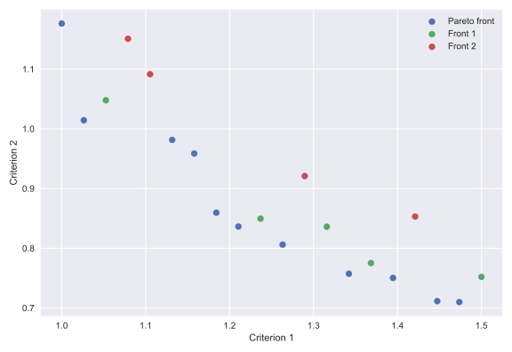

# Non-dominated sorting

## Summary

Implementation for .Net Core. Supported version .NET Standard is 1.0.

It does not require third-party dependencies.

## Building

* Use Visual Studio 2017.
* Or [CLI](https://docs.microsoft.com/en-us/dotnet/core/tools/?tabs=netcore2x):
    * `cd Src`
    * Run `dotnet build -c Release`.
    * If necessary, run tests `dotnet test -c Release .`.

## Description of the method

You can read about the method in the next article:

Buzdalov M., Shalyto A. A Provably Asymptotically Fast Version of the Generalized Jensen Algorithm for Non-dominated Sorting  // Parallel Problem Solving from Nature XIII.- 2015. - P. 528-537. - (Lecture Notes on Computer Science ; 8672)

## Other implementations

* [Java (Jensen-Fortin-Buzdalov divide-and-conquer method)](https://github.com/mbuzdalov/non-dominated-sorting)
* [Python](https://github.com/KernelA/nds-py)

## How to use

See `Example` in the solution.

## Example

